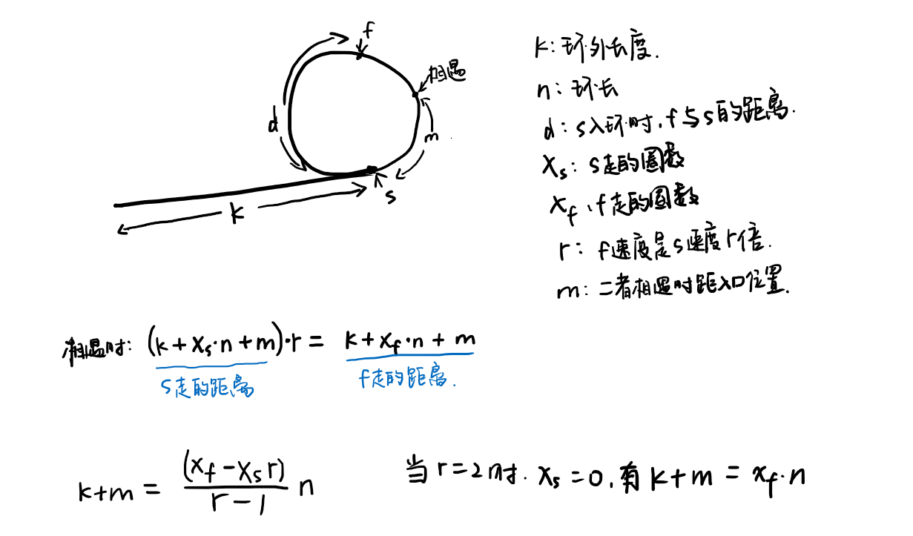

## 1. hash表
hash表储存整个节点和其位置，遇到节点时通过判断是否已在hash表中来判断是否有环。  
时间`O(n)`，空间`O(n)`。  
```cpp
/**
 * Definition for singly-linked list.
 * struct ListNode {
 *     int val;
 *     ListNode *next;
 *     ListNode(int x) : val(x), next(NULL) {}
 * };
 */
class Solution {
public:
    bool hasCycle(ListNode *head) {
        bool ans = false;
        unordered_map<ListNode*, int> table;

        int loc = 0;
        while (head != nullptr) {
            if (table.count(head) == 1) {
                ans = true;
                break;
            } else
                table[head] = loc++;
            head = head->next;
        }

        return ans;
    }
};
```
  
## 2. 快慢指针
步长分别为1和2的指针，在有限步数中一定会相遇（如果存在环的话）。  
原因是，当slow到达环的入口进入环中时，二者相距d，而`d<环长S`，二者相对速度为1，可以看作slow不动而fast每次接近slow1个单位距离，这样便一定能在位移d次后相遇，并且此时d次的位移不足以使得slow重新到达起点（入口），也说明了slow位移不会超过一圈。  
时间`O(n)`，空间`O(1)`。  
```cpp
class Solution {
public:
    bool hasCycle(ListNode *head) {
        bool ans = false;
        ListNode* slow = head;
        ListNode* fast = head;
        while (fast != nullptr && fast->next != nullptr && fast->next->next != nullptr) {
            slow = slow->next;
            fast = fast->next->next;
            if (slow == fast) {
                ans = true;
                break;
            }
        }

        return ans;
    }
};
```
  
## 3. 快慢指针的拓展
首先可以得到的结论是：  
  
**只要快慢指针从同一起点出发，则一定能相遇（从起点出发，在环长度的倍数倍位置上一定能相遇，不论快慢指针步长如何。但首次相遇位置不一定在此处），并且当快指针速度是慢指针的整数倍时，相遇时慢指针在圆环中移动的距离不足一周。**  
  
原因是，设圆环外链表长度为k，圆环长度为n，快指针速度是慢指针的r倍。  
先考虑r为整数的情况：  
令慢指针前进S（S为n的倍数，并且满足`k<=S<k+n`）距离，保证慢指针能够位移进入圆环，此时，快指针移动的距离为rS，可以看作先前进了S到达慢指针前进S到达的地点，又前进了(r-1)S，这部分为n的倍数，相当于转圈。因此便证明了上述结论。  
考虑r为小数的情况：  
此时上述提到的快指针移动的距离rS不一定为整数，为保证rS为整数，需要增大S，而增大S便会导致S>=k+n，所以慢指针在圆环中移动的距离会超过一周。  
  
S处考虑的只是一定能相遇的情况，而在慢指针前进不足S时，也有可能相遇，比如slow = 1, fast = 5, k = 1, n = 4，快慢指针位移一次即可相遇。  
  
  
**除了判断环形链表，快慢指针还能干什么？**  
1. 找链表的中点。  
2. 求环形链表的长度  
3. 找环形链表的开头  
  
因为已经得到了必定相遇的结论，因此以下使用慢指针=1，快指针=2的步长。  
  
  
由上图可以得知，k+m是环长n的整数倍，因此从相遇点继续前进k长的距离就会到达圆环入口。    
所以可以另设一个新的指针从链表头出发，以1的速度与慢指针同步前进，二者相遇的位置即为入口。  
至于环的长度，保持快指针不动，慢指针走至重新重合即可获得长度。  

