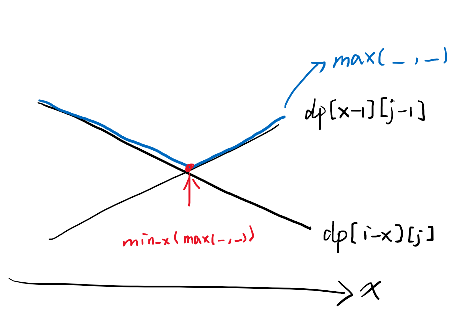

## 框架
```cpp
class Solution {
public:
    int superEggDrop(int K, int N) {

    }
};
```
  
## 1. 动态规划+二分
设计`dp[i][j]`代表i层楼j个蛋，最少需要多少次一定能测出分界楼层。  
想象在任意楼层，扔下一个鸡蛋，可能有碎和不碎两种结果。碎则说明分界楼层在下部分，不碎则说明在上部分。  
由于我们不知道分界楼层到底在哪里，而是要求`dp[i][j]`次一定能找出该楼层，所以得到状态转移方程：  
  
`dp[i][j] = min_x(max(dp[x-1][j-1], dp[i-x][j])) + 1`  
i层楼j个蛋能够测出分界楼层需要的最少次数 = 遍历中间任意一层楼x在此处扔鸡蛋找一个最小值（max(在x楼扔碎了去下半部分再找需要的次数, 在x楼扔没碎去上半部分再找需要的次数)）+1  
  
*为什么取上部分和下部分的最大值？*  
因为不知道具体是碎没碎，所以需要一个最大值保证不管是碎不碎都可以找到分界楼层。  
*为什么遍历所有楼层x，在x楼扔鸡蛋？*  
因为不知道分界楼层在哪，还要得到一定能测出分界楼层的最小次数，那就遍历x在x楼扔，找一个得到的次数最小的x楼。  
  
时间复杂度`O(kn^2)`，k个蛋，n层楼。空间复杂度`O(kn)`。  
以上时间复杂度对这个题目是超时的，所以需要优化。  
  
考虑在找x楼的时候，是遍历当前的所有楼层，得到一个`min_x(max(dp[x-1][j-1], dp[i-x][j]))`。  
随着x的增大，`dp[x-1][j-1]`增大（楼层多了），`dp[i-x][j]`减小（楼层少了）。  
根据下图，要得到的`min_x(...)`即当`dp[x-1][j-1] == dp[i-x][j]`相等时的值。  
  
直接找`dp[x-1][j-1] == dp[i-x][j]`的`x`是不方便的，所以可以找使得`dp[x-1][j-1] <= dp[i-x][j]`成立的最大值`x`，这里就可以二分了。  
  
由于将原本`O(n)`的遍历楼层的过程改为了二分，所以时间复杂度降低为`O(knlogn)`。  
  
```cpp
class Solution {
public:
    int superEggDrop(int K, int N) {
        int** dp = new int* [N + 1];
        for (int i = 0; i <= N; i++)
            dp[i] = new int[K + 1];
        for (int i = 0; i <= N; i++) {
            for (int j = 0; j <= K; j++) {
                if (i == 0 || j == 0)   // 0层楼或0个蛋
                    dp[i][j] = 0;
                else if (i == 1)        // 1层楼试一下
                    dp[i][j] = 1;
                else                    // 最多试i下
                    dp[i][j] = i;
            }
        }

        for (int i = 1; i <= N; i++) {
            for (int j = 1; j <= K; j++) {
                int left = 1, right = i;
                while (left <= right) {
                    int mid = (left + right) / 2;
                    if (dp[mid - 1][j - 1] <= dp[i - mid][j]) {
                        dp[i][j] = min(dp[i][j], dp[i - mid][j] + 1);
                        left = mid + 1;
                    }
                    else {
                        dp[i][j] = min(dp[i][j], dp[mid - 1][j - 1] + 1);
                        right = mid - 1;
                    } 
                }
            }
        }

        int ans = dp[N][K];
        for (int i = 0; i <= N; i++)
            delete []dp[i];
        delete []dp;

        return ans;
    }
};
```