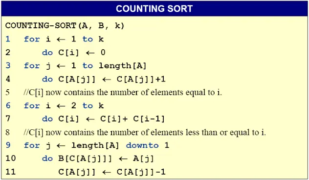
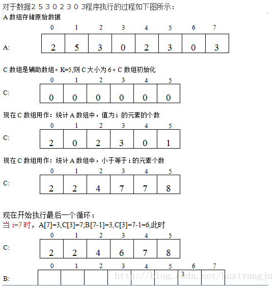
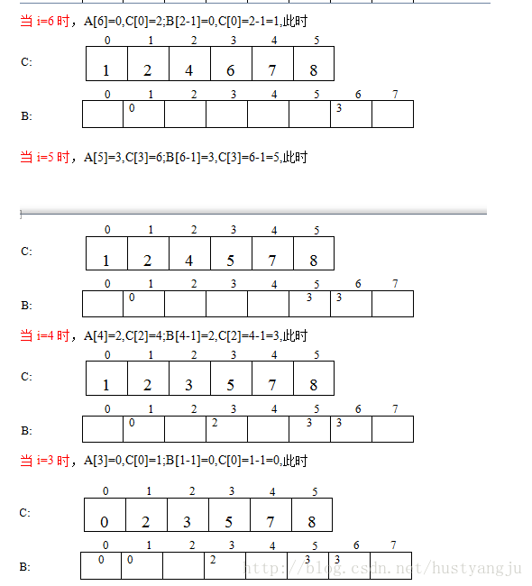
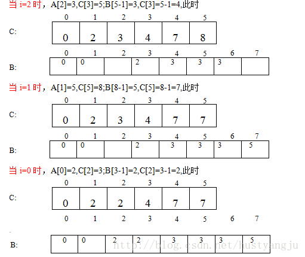

## 框架
```cpp
class Solution {
public:
    vector<int> sortArray(vector<int>& nums) {
        
    }
};
```
  
练习排序的题，要求复杂度`O(nlogn)`。  
  
## 1. 憨批解法之直接sort()
```cpp
class Solution {
public:
    vector<int> sortArray(vector<int>& nums) {
        sort(nums.begin(), nums.end());
        return nums;
    }
};
```
  
## 2. 计数排序
计数排序的时间复杂度是`O(n+range)`的，空间复杂度是`O(range)`。  
由于计数排序不是比较排序，所以不受最优时间复杂度是`O(nlogn)`的限制。  
计数排序是稳定的排序方法，但是下面的代码不是稳定的。  
```cpp
class Solution {
public:
    vector<int> sortArray(vector<int>& nums) {
        int *counter = new int[100010]{};   //需要加{}进行初始化
        for (int i = 0; i < nums.size(); i++)
            counter[nums[i] + 50000]++;
        
        int k = 0;
        for (int i = 0; i <= 100000; i++) {
            if (counter[i] != 0) {
                for (int j = counter[i]; j > 0; j--)
                    nums[k++] = i - 50000;
            }
        }

        delete []counter;
        return nums;
    }
};
```
稳定的计数排序如下所示，A是待排数组，B是排序之后的数组，k是范围：  
  
大致流程是：  
1. `C[i]`首先记录`i`的出现次数，遍历数组`A`。  
2. `C[i]`之后作为记录小于等于`i`的元素的出现次数，即`C[i] = C[i] + C[i - 1]`。  
3. 从数组`A`的最后一个元素开始，倒着向前遍历`A[i]`。  
   - 检查`C[A[i]]`获得元素`A[i]`的出现次数。  
   - 由于`A[i]`元素必存在，且通过`C[A[i]]`获得了小于等于`A[i]`的元素的个数，因此`A[i]`在有序数组`B`中的位置最大为`C[A[i]] - 1`。  
   - `B[C[A[i]] - 1] = A[i]`，然后`C[A[i]]--; i--;`.  
   - 逆序遍历完`A`数组之后，`C[i]`就变成了小于i的元素的个数，`B`为有序的新数组。  
4. 以上方法就相当于倒着每次把数组`A`中最后的元素放到它可能在的最后的位置，从而保证了是稳定的。  
  
  
  
  
  
## 3. 堆排序
