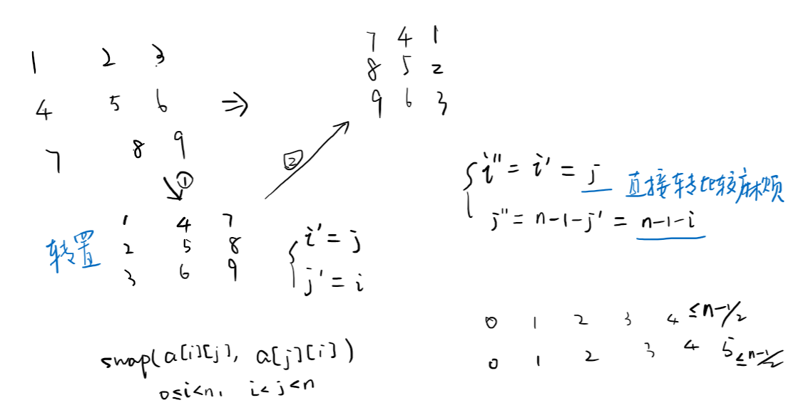

## 框架
```cpp
class Solution {
public:
    void rotate(vector<vector<int>>& matrix) {

    }
};
```
  
## 1. 先转置后对称
  
```cpp
class Solution {
public:
    void rotate(vector<vector<int>>& matrix) {
        int n = matrix.size();
        for (int i = 0; i < n; i++)
            for (int j = i + 1; j < n; j++)
                swap(matrix[i][j], matrix[j][i]);
        
        for (int i = 0; i < n; i++)
            for (int j = 0; j <= (n - 1) / 2; j++)
                swap(matrix[i][j], matrix[i][n - 1 - j]);
    }
};
```